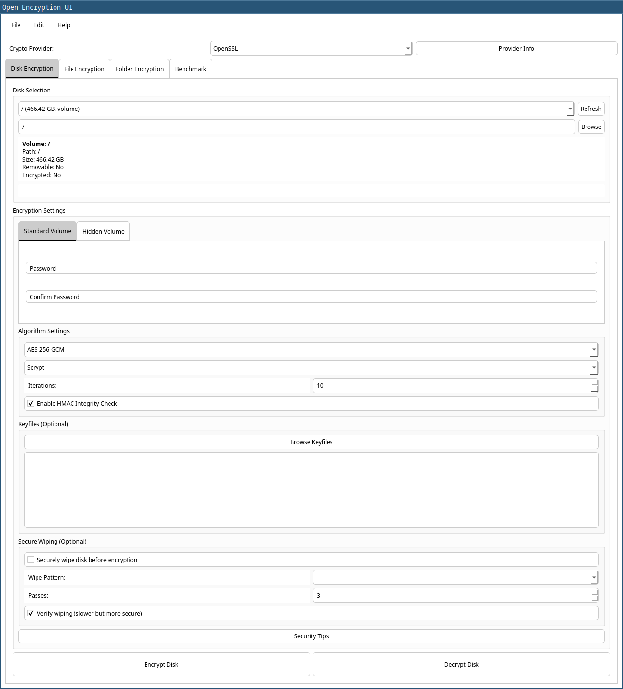

# OpenCryptUI

OpenCryptUI is a Qt-based graphical user interface application for file and folder encryption. It supports various encryption algorithms and key derivation functions.



## Features

- Encrypt and decrypt files and folders.
- Support for multiple encryption algorithms: AES-256-CBC, AES-256-GCM, AES-256-CTR, ChaCha20-Poly1305, Camellia (128/256), AES-128-CBC, and others.
- Support for multiple key derivation functions: PBKDF2, Argon2, and Scrypt.
- Option to enable HMAC / AEAD authentication for integrity checks.
- Memory protection: Sensitive keys are securely erased from memory after use (`OPENSSL_cleanse`, `sodium_memzero`, `mlock`).
- Keyfile support: Combine one or more external keyfiles with the password for layered security.
- Hardware acceleration support: Automatically detects AES-NI and other hardware features.
- Built-in benchmark: Compare performance of different cipher/KDF combos in MB/s and ms.
- GUI-based folder compression and encryption using `.tar.gz` wrapping.
- Multi-provider backend: OpenSSL, libsodium, and Argon2 are all supported and switchable at runtime.

## Dependencies

- Qt 5 or later
- OpenSSL
- Libsodium
- Argon2
- CMake

## Building the Project

To build the project, follow these steps:

1. Clone the repository:
   ```bash
   git clone <repository_url>
   cd opencryptui
   ```

2. Create a build directory and navigate to it:
   ```bash
   mkdir build
   cd build
   ```

3. Run CMake to configure the project:
   ```bash
   cmake ..
   ```

4. Build the project using `make`:
   ```bash
   make
   ```

5. Run the application:
   ```bash
   ./OpenCryptUI
   ```

## Detailed Installation Instructions

For detailed installation instructions, please refer to the following:

- [Linux](installation/linux.md)
- [Windows](installation/windows.md)
- [macOS](installation/osx.md)

## Usage

1. Launch the application:
   ```bash
   ./OpenCryptUI
   ```

2. Use the "File Encryption" tab to encrypt or decrypt individual files:
   - Browse and select the file.
   - Enter the password.
   - Choose the encryption algorithm and key derivation function.
   - Set the number of iterations.
   - (Optional) Enable HMAC integrity check.
   - (Optional) Add one or multiple keyfiles.
   - Click "Encrypt" or "Decrypt".

3. Use the "Folder Encryption" tab to encrypt or decrypt entire folders:
   - Browse and select the folder.
   - Enter the password.
   - Choose the encryption algorithm and key derivation function.
   - Set the number of iterations.
   - (Optional) Enable HMAC integrity check.
   - (Optional) Add one or multiple keyfiles.
   - Click "Encrypt Folder" or "Decrypt Folder".

## Contributing

Contributions are welcome! If you find a bug or want to add a new feature, please open an issue or submit a pull request.

## License

This project is licensed under the MIT License. See the `LICENSE` file for details.

## Todo

OpenCryptUI aims to implement several additional features found in expert-level encryption tools and hardened security workflows:

- **Hidden volumes:** Create hidden encrypted volumes within existing volumes for plausible deniability.
- **Secure wipe:** Fully implement secure deletion (multiple passes, inode scrub) of plaintext files after encryption.
- **Shamir Secret Sharing:** Optionally split the encryption key into multiple shares (e.g. 3-of-5) to improve redundancy and reduce risk.
- **Hardware token integration:** Support for YubiKey (HMAC challenge/response or PGP smartcard mode) during key derivation.
- **Double-layer encryption:** Encrypt file using symmetric key, then encrypt that key with user’s PGP or RSA hardware key.
- **Tamper-evident wrappers:** Bundle hashes and digital signatures (Ed25519 or OpenTimestamps) with encrypted payloads.
- **Plausible deniability modes:** Dual-password support to unlock either dummy or real data depending on the password entered.
- **Ephemeral unlock mode:** Temporary decryption with automatic cleanup after timeout or UI close.
